<a href="./README.md">中文</a> ｜ <strong>English</strong>

  

  <a href="https://yuanjuju.github.io/en/">📝 Blog</a> &nbsp;·&nbsp;
  <a href="https://github.com/yuanjuju?tab=repositories">📦 Repositories</a> &nbsp;·&nbsp;
  <a href="mailto:13548727058@163.com">✉️ Email</a>

## About me

- 🎓 Currently pursuing a master's degree
- 🛰️ Focusing on computer vision
- 🛠️ Enjoy building tools that make work more efficient
- 🌏 Always curious about new stories and distant horizons
- 🤓 Open to ideas, conversations, and new connections

## 🎮 GitHub activity

  <picture>
    <source media="(prefers-color-scheme: dark)" srcset="./assets/activity-dark.svg">
    
  </picture>

## 🔬 Research & learning

- [MetaToken-FusAtNet](https://github.com/yuanjuju/MetaToken-FusAtNet) — Hyperspectral and LiDAR multimodal classification.
- [MiniMind Training Systems Lab](https://github.com/yuanjuju/minimind-learning) — Two-stage language model training, supervision contracts, decoder architecture auditing, and optimizer state analysis.
- [vLLM Inference Systems Lab](https://github.com/yuanjuju/vllm-lab) — Heterogeneous backend validation, runtime observability, and SLO-constrained inference performance analysis.

## 📝 Recent posts

- [Training a 64M model from scratch: my MiniMind pretraining and SFT notes](https://yuanjuju.github.io/en/posts/minimind-from-pretrain-to-sft/)
- [My first week of graduate school](https://yuanjuju.github.io/en/posts/first-week-of-grad-school/)
- [Fixing Codex's persistent Reconnecting issue](https://yuanjuju.github.io/en/posts/fix-codex-reconnecting/)
